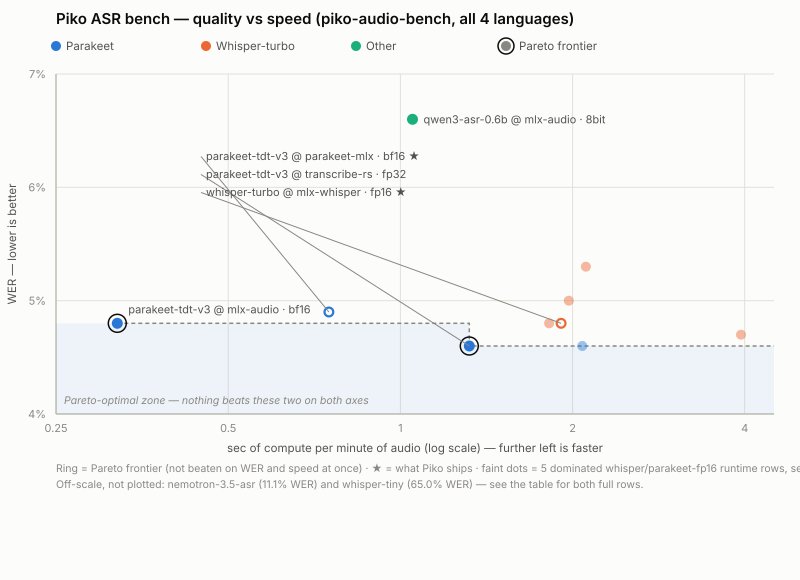

# Piko ASR Benchmark

On-device speech-to-text evaluation for [Piko](../../README.md): quality (WER)
and speed measured together, on the hardware the product actually runs on.

- **Hardware**: Apple M4 Max, 14-core CPU, 32-core GPU, 36 GB unified RAM, macOS · MLX / Metal
  (see [Inference parameters](#inference-parameters) for per-engine thread/GPU
  settings — nothing pinned or throttled beyond each library's own defaults)
- **Date**: 2026-07-26
- **Reference benchmark**: not our own corpus — [FLEURS](https://huggingface.co/datasets/google/fleurs)
  (Google, [Conneau et al. 2022](https://arxiv.org/abs/2205.12446)), the
  standard multilingual ASR eval also used by the original Whisper paper and
  the [HF Open ASR Leaderboard](https://huggingface.co/spaces/hf-audio/open-asr-leaderboard).
  *piko-audio-bench* is a 108-utterance / 20.1-min sample drawn from FLEURS'
  `test` split (4 languages) — see [Benchmark data](#benchmark-data) for exact
  sampling — chosen so our numbers stay comparable to published FLEURS results
  while keeping local eval runs to minutes, not hours.
- **Speed**: pure transcription compute (model loaded once, load time reported
  separately), `sec/min` = seconds of compute per minute of audio, RTF =
  real-time factor (higher = faster)

## Leaderboard

One table, every model **and** every engine, all measured on the identical
piko-audio-bench data. The `whisper-large-v3-turbo @ *` and
`parakeet-tdt-0.6b-v3 @ *` rows are the exact same weights through different
runtimes — same model, engine is the only variable — so engine overhead is
visible directly in the table instead of a separate document.

**Frontier** (🏆) = genuinely Pareto-optimal: no other row beats it on *both*
WER and speed at once. Everything below is beaten on both axes by at least one
frontier row — "dominated" isn't a euphemism, it's arithmetic. **Dominated rows
are still listed and some are still shipped**: engineering cost (toolchain,
dependency weight, language coverage, a feature the frontier pick lacks) is a
real axis this table doesn't plot.

Sorted by a blended **eff** score — `RTF ÷ WER` (accuracy per unit of speed,
higher is better) — instead of WER alone, so a row's speed advantage is
weighed against its accuracy in one number rather than eyeballed across two
columns. This is independent of the 🏆 Frontier tags: those mark strict
Pareto-optimality (unbeaten on *both* axes at once) and don't move with this
score. On `eff`, parakeet-tdt-0.6b-v3 @ mlx-audio leads the whole table —
its 2.3× speed edge over parakeet-mlx dominates the score even though its WER
is marginally worse than the transcribe-rs frontier row.

<picture>
  <source media="(prefers-color-scheme: dark)" srcset="charts/pareto-dark.svg">
  
</picture>

*(Static image — GitHub markdown can't render interactive JS. Generated by
[charts/make_pareto_svg.py](charts/make_pareto_svg.py) from the table below;
regenerate after any leaderboard number changes.)*

| # | model @ engine | params / quant | disk | WER ↓ | CER | sec/min ↓ | RTF | eff (RTF÷WER) ↑ | verdict |
|---|-------|----------------|------|-------|-----|-----------|-----|-----------------|---------|
| 🏆 | parakeet-tdt-0.6b-v3 @ mlx-audio (bf16) | 0.6 B · bf16 | 2.3 GB | 4.8 % | 1.7 % | **0.32** | **190×** | **39.6** | **Frontier: fastest on the board**, 2.3× faster than parakeet-mlx at nearly the same WER — confirms the [long-form check](#real-world-long-form-check)'s finding that mlx-audio's decode loop genuinely beats parakeet-mlx's. Also tops the board on the blended `eff` score. Not adopted: mlx-audio was already rejected as the unified engine (its whisper path needs full uncompressed HF repos, heavier dependency tree overall), and parakeet-mlx's own speed (a 30-min meeting in ~16 s) is already so far past the usability bar that this 2.3× has no product-visible effect. |
| 2 | parakeet-tdt-0.6b-v3 @ parakeet-mlx (`mlx-community/parakeet-tdt-0.6b-v3`) | 0.6 B · bf16 | 2.3 GB | 4.9 % | 1.9 % | 0.75 | 80× | 16.3 | **Piko default**, despite being dominated by both frontier rows on this table. Still ~1 GB RSS, no hallucination loops (see [long-form check](#real-world-long-form-check)), 25 languages, and the reasons the two frontier rows aren't adopted (see above) apply directly to why this one is. |
| 🏆 | parakeet-tdt-0.6b-v3 @ transcribe-rs (ONNX, meetily stack) | 0.6 B · fp32 | 2.4 GB | **4.6 %** | 1.7 % | 1.32 | 46× | 10.0 | **Frontier: best WER on the board.** CPU execution provider only (CoreML fails to load — see [note](#onnx-parakeet-via-transcribe-rs-the-meetily-stack)). Not adopted: a second (Rust/ONNX) runtime in the bundle for a 0.3pt WER gain over the frontier speed pick isn't worth it. |
| 4 | Qwen3-ASR-0.6B @ mlx-audio (`mlx-community/Qwen3-ASR-0.6B-8bit`) | 0.6 B · 8-bit | 1.0 GB | 6.6 % | 2.6 % | 1.05 | 57× | 8.6 | Fast, EN on par with the leaders (4.8 %), but RU 7.8 % — watch for future versions. |
| 5 | whisper-large-v3-turbo @ mlx-audio (`openai/whisper-large-v3-turbo`) | 0.8 B · fp16 | 1.5 GB | 4.8 % | 1.7 % | 1.82 | 33× | 6.9 | Dominated by both frontier rows (and by mlx-whisper below on nothing — the two whisper-turbo runtimes are themselves in a near-tie, mlx-audio only marginally faster). Not adopted: needs the full HF repo, no quantized mlx-community support. |
| 6 | **whisper-large-v3-turbo** @ mlx-whisper (`mlx-community/whisper-large-v3-turbo`) | 0.8 B · fp16 | 1.5 GB | 4.8 % | 1.7 % | 1.91 | 31× | 6.5 | **Piko alternative — what Piko ships today.** Dominated on paper by both frontier rows, kept for 99-language coverage, per-word confidence (needed by the captions skill), and quantized mlx-community repo compatibility mlx-audio's loader lacks. |
| 7 | parakeet-tdt-0.6b-v3 @ transcribe-rs, fp16 (ONNX, meetily stack) | 0.6 B · fp16* | 1.5 GB | 4.6 % | 1.7 % | 2.08 | 29× | 6.3 | Same WER as the fp32 row, but **slower** — CPU has no fast fp16 kernel path in this onnxruntime build, so it upcasts to fp32 per-op instead of gaining anything. See [note](#onnx-parakeet-via-transcribe-rs-the-meetily-stack). \*decoder stayed fp32 in the export used; only the encoder is fp16. |
| 8 | whisper-large-v3-turbo @ transcribe-rs (ggml, meetily stack) | 0.8 B · fp16 | 1.5 GB | 5.0 % | 1.7 % | 1.97 | 30× | 6.0 | Rust/whisper.cpp wrapper — a native binary in the app bundle for parity with mlx-whisper, still 2.6× slower than parakeet-mlx. Not worth the extra toolchain. |
| 9 | whisper-large-v3-turbo @ whisper.cpp CLI (ggml, direct) | 0.8 B · fp16 | 1.5 GB | 5.3 % | 2.4 % | 2.11 | 28× | 5.3 | Worst quality of the whisper runtimes on this bench (batched CLI invocation, no beam smoothing across files) — confirms the Rust wrapper adds no overhead of its own. |
| 10 | whisper-large-v3-8bit @ mlx-whisper (`mlx-community/whisper-large-v3-mlx-8bit`) | 1.5 B · 8-bit | 1.7 GB | 4.7 % | 1.8 % | 3.94 | 15× | 3.2 | Dominated by both frontier rows. Marginal WER edge over turbo, 2× slower than turbo itself. Dropped from the registry. |
| 11 | nemotron-3.5-asr-streaming @ mlx-audio (`mlx-community/nemotron-3.5-asr-streaming-0.6b`) | 0.6 B · bf16 | 1.3 GB | 11.1 % | 5.4 % | 2.72 | 22× | 2.0 | Native streaming, 35 languages, but worst usable quality and slow in batch. Only relevant if hard realtime is required. |
| 12 | whisper-tiny @ mlx-whisper (`mlx-community/whisper-tiny`) | 39 M · fp16 | 75 MB | 65.0 % | 39.9 % | 0.59 | 101× | 1.6 | Unusable for transcription outside EN (65–121 % WER), and dominated even on speed by the mlx-audio frontier row. Kept only as a hidden ~1 s language-ID router. |

**Product decision**: Piko ships **parakeet via parakeet-mlx (default) + turbo
via mlx-whisper (alternative)**, with whisper-tiny as an internal language
router (parakeet silently garbles languages outside its 25 → route those to
turbo) — **neither pick is the Pareto frontier on this table**, and that's a
deliberate trade: both frontier rows require a runtime this codebase doesn't
otherwise carry (a Rust/ONNX toolchain, or mlx-audio's heavier dependency
tree previously rejected as the unified engine), for a margin — 0.3pt WER, or
2.3× on a step that's already 100× real-time — with no visible effect on the
product. The engine question is otherwise settled for whisper: no native
binary earns its keep, every turbo runtime lands within ~10 % WER and ~15 %
speed of mlx-whisper.

### ONNX Parakeet via transcribe-rs (the meetily stack)

The `parakeet@transcribe-rs` rows run the `parakeet-tdt-0.6b-v3` checkpoint
through `transcribe-rs`'s ONNX Runtime backend — the same crate
[meetily](https://github.com/Zackriya-Solutions/meetily) uses. Two exports
were tested, both CPU execution provider (see the CoreML finding below):
fp32 ([`istupakov/parakeet-tdt-0.6b-v3-onnx`](https://huggingface.co/istupakov/parakeet-tdt-0.6b-v3-onnx))
and fp16 ([`BugCat/parakeet-tdt-0.6b-v3-onnx-fp16`](https://huggingface.co/BugCat/parakeet-tdt-0.6b-v3-onnx-fp16),
encoder-only fp16 — its decoder ships the same byte size as the fp32 repo's,
so only the dominant-cost encoder was actually requantized). Findings:

- **CoreML execution provider fails to load the model.** With the `ort-coreml`
  feature enabled, session creation throws `model_path must not be empty`
  during initializer setup — a known class of onnxruntime bug where the
  CoreML EP's graph-partitioning step creates in-memory sub-models that lose
  the original file path, breaking external-data resolution for the 2.3 GB
  `encoder-model.onnx.data` sidecar. Every ONNX number in this doc is **CPU
  execution provider only**; ANE/GPU acceleration was not exercised.
- **fp16 is not a free win on CPU — it's slower than fp32 here** (2.08 vs
  1.32 s/min, same 4.6 % WER). ONNX Runtime's CPU execution provider has no
  fast native fp16 matmul path on this platform; it upcasts fp16 tensors to
  fp32 per-op, paying a conversion tax for a smaller file with no compute
  benefit. fp32 stays the right CPU baseline for this ONNX Runtime version —
  don't assume a lower-precision export is faster without measuring, per the
  [dtype finding](#real-world-long-form-check) in the long-form check (fp16
  wasn't the fast choice for MLX whisper either).
- fp32 still edges out MLX-bf16 on WER (4.6 % vs 4.9 %) and outruns every
  whisper runtime on speed (46× RTF) despite CPU-only execution — a
  reasonable chunk of that WER gap may be fp32 vs bf16 weights rather than the
  engine itself. `transcribe-rs`'s own capability metadata claims Parakeet is
  English-only (`languages: &["en"]`); that's stale for this checkpoint — v3
  transcribed ru/de/fr correctly in every run here.

## Per-language results (WER)

| model @ engine | 🇷🇺 ru | 🇬🇧 en | 🇩🇪 de | 🇫🇷 fr |
|---|---|---|---|---|
| parakeet-tdt-0.6b-v3 @ mlx-audio (bf16) | **3.6 %** | 6.0 % | **4.6 %** | 4.6 % |
| parakeet-tdt-0.6b-v3 @ parakeet-mlx | 4.2 % | 4.9 % | 4.4 % | 5.6 % |
| parakeet-tdt-0.6b-v3 @ transcribe-rs, fp32 (ONNX, CPU) | 3.8 % | 4.9 % | 4.8 % | 4.6 % |
| Qwen3-ASR-0.6B-8bit @ mlx-audio | 7.8 % | 4.8 % | 5.6 % | 8.0 % |
| turbo @ mlx-audio | 2.4 % | 4.5 % | 3.5 % | 7.2 % |
| turbo @ mlx-whisper | 2.4 % | **4.5 %** | 3.5 % | 7.2 % |
| parakeet-tdt-0.6b-v3 @ transcribe-rs, fp16 (ONNX, CPU) | 3.8 % | 4.9 % | 4.8 % | **4.6 %** |
| turbo @ transcribe-rs | 2.6 % | 5.1 % | 4.0 % | 7.1 % |
| turbo @ whisper.cpp CLI | **2.2 %** | 4.8 % | 6.9 % | 6.8 % |
| whisper-large-v3-8bit @ mlx-whisper | 2.8 % | 4.9 % | **3.1 %** | 6.7 % |
| nemotron-3.5-streaming @ mlx-audio | 10.2 % | 11.7 % | 9.6 % | 12.0 % |
| whisper-tiny @ mlx-whisper | 79.5 % | 13.6 % | 121.1 % | 64.0 % |

The three whisper-turbo runtimes agree closely on ru/en/fr but split hardest on
German (3.5 % mlx vs 6.9 % raw whisper.cpp) — batched CLI decoding without
mlx-whisper's per-segment handling costs the most on the language with the
fewest bench samples (22 utterances), so treat that gap as noisy rather than a
firm runtime ranking. mlx-audio's Parakeet is the outlier on English (6.0 % vs
4.9–4.9 % for the other two Parakeet runtimes) — same weights, so this is
runtime/dtype behavior, not the checkpoint; worth another look before treating
its speed advantage as a free lunch on every language.

Full table with CER, insertion rate and per-slice speed: [results/EVAL.md](results/EVAL.md).

## Inference parameters

No engine was hand-tuned beyond its published default decoding config — the
point of the bench is what Piko gets out of the box, not a best-case tune. All
engines run on Metal/GPU (Apple Silicon has no separate "CPU-only" fast path
worth benchmarking here); thread counts below are whisper.cpp/transcribe-rs's
CPU-side pre/post-processing only.

| model @ engine | decoding | key defaults | dtype | threads |
|---|---|---|---|---|
| parakeet-tdt-0.6b-v3 @ parakeet-mlx | TDT greedy (no beam — architecture has no beam search) | `chunk_duration=120s`, `overlap_duration=15s` (required: unchunked 30-min audio OOMs Metal) | bf16 | — |
| turbo @ mlx-whisper | greedy + temperature fallback | `temperature=(0.0,0.2,0.4,0.6,0.8,1.0)`, `compression_ratio_threshold=2.4`, `logprob_threshold=-1.0`, `no_speech_threshold=0.6`, `condition_on_previous_text=True` | fp16 | — |
| turbo @ mlx-audio | same decoder as mlx-whisper (vendored), same fallback ladder | `dtype` explicit fp16 (library default; bf16 measured slower for whisper — see [long-form check](#real-world-long-form-check)) | fp16 | — |
| turbo @ transcribe-rs | beam search | `beam_size=3`, `patience=-1.0` (crate default, not tuned) | fp16 (ggml) | library default (unset) |
| turbo @ whisper.cpp CLI | beam search | `--beam-size 5 --best-of 5` (whisper-cli binary default, unset by us) | fp16 (ggml) | `-t 4` (binary default) |
| Qwen3-ASR-0.6B @ mlx-audio | LLM greedy decode | library default | 8-bit (as published) | — |
| nemotron-3.5-asr-streaming @ mlx-audio | FastConformer-RNNT | library default, non-streaming call path (`generate()`, not the streaming API) | bf16 | — |
| whisper-tiny @ mlx-whisper | same as turbo @ mlx-whisper | same | fp16 | — |
| parakeet-tdt-0.6b-v3 @ transcribe-rs, fp32 | TDT greedy (same architecture, no beam) | `Quantization::FP32`; ONNX Runtime **CPU execution provider** (CoreML EP fails to load — see [note](#onnx-parakeet-via-transcribe-rs-the-meetily-stack)) | fp32 | ORT default (unset) |
| parakeet-tdt-0.6b-v3 @ transcribe-rs, fp16 | same TDT greedy decode | same CPU execution provider; `BugCat/parakeet-tdt-0.6b-v3-onnx-fp16` export (encoder only — its decoder file matches the fp32 repo's byte size) | fp16 (encoder), fp32 (decoder) | ORT default (unset) |
| parakeet-tdt-0.6b-v3 @ mlx-audio | same TDT greedy decode as parakeet-mlx (mlx-audio vendors the same architecture) | loaded via the internal `Model.from_pretrained(dtype=bf16)`, not mlx-audio's public `load_model()` API (which keeps checkpoint dtype — fp32, 2.3× the RAM, no speed benefit; see [long-form check](#real-world-long-form-check)) | bf16 | — |

Language is passed explicitly per utterance (from the FLEURS split, no
language-ID pass) for every engine except parakeet, which has no language
parameter — it infers language from audio.

## Benchmark data

*piko-audio-bench* — a single compact set, one canonical domain for every
language so cross-language numbers stay comparable (and comparable to published
FLEURS results):

| slice | source | utts | minutes |
|---|---|---|---|
| ru | `google/fleurs` ru_ru test | 27 | 5.1 |
| en | `google/fleurs` en_us test | 32 | 4.9 |
| de | `google/fleurs` de_de test | 22 | 5.0 |
| fr | `google/fleurs` fr_fr test | 27 | 5.2 |

16 kHz mono PCM WAVs + `refs.jsonl` (id, reference text, duration, source,
lang). Sampling is deterministic (evenly spaced over the test split, no RNG) —
rebuilding produces the identical set. Normalization before scoring: lowercase,
strip punctuation, `ё → е`, collapse whitespace; same normalizer for every
model.

**Other datasets considered, and why they were dropped** (surveyed on HF Hub
2026-07-26 via `hf datasets ls`):

| dataset | would have added | why dropped |
|---|---|---|
| Golos farfield 100h (`bond005/sberdevices_golos_100h_farfield`) | RU spontaneous speech, far-field mic — closest to "laptop on the meeting table" | breaks the one-domain-per-language design; kept as a candidate for a future spontaneous-speech bench, not blended into piko-audio-bench |
| AMI (`edinburghcstr/ami`) | real multi-speaker EN meetings | same reason — long-form/spontaneous is covered instead by the [real-recording check](#real-world-long-form-check) below |
| Common Voice (`fsicoli/common_voice_22_0`, ungated mirror) | crowdsourced accents/noisy mics | redundant with FLEURS for a v1 cut; canonical `mozilla-foundation/*` is gated anyway |
| Earnings-22, TED-LIUM, MLS, VoxPopuli | more long-form / breadth langs | same reasoning — parked, not needed to make the parakeet-vs-turbo call |

`nvidia/Granary` / `espnet/yodas-granary` are parakeet-tdt-0.6b-v3's own
training data — never eval on them, they'd flatter parakeet.

## Real-world long-form check

FLEURS is read speech, one sentence per file — it can't reproduce the one
failure mode that actually matters for meetings: **hallucination loops on
noisy, spontaneous, long-form audio** (insertion rate on FLEURS is <1 % for
every model above). A separate check on a real 30-min Russian screencast
([REPORT.md](REPORT.md)) found every whisper-large-v3-turbo runtime — mlx-whisper,
whisper.cpp, transcribe-rs — falling into repetition loops on hard segments (up
to 18× repeats, e.g. "окурек окурек окурек…"); parakeet produced none. This is
the reason parakeet is the default despite whisper's better raw WER on FLEURS.

Two integration gotchas only visible there: parakeet **OOMs Metal on
unchunked 30-min audio** (asks for a 32 GB buffer) — `chunk_duration=120s`
(15s overlap) is mandatory; and mlx-whisper's `word_timestamps=True` (needed by
the captions skill) costs ~35 % extra transcription time.

## Reproduce

```bash
# 1. materialize source cells (streams from HF, no full downloads)
uv run --script bench/asr/eval_prep.py fleurs_ru --minutes 30
uv run --script bench/asr/eval_prep.py fleurs_en --minutes 30
uv run --script bench/asr/eval_prep.py fleurs_de --minutes 6
uv run --script bench/asr/eval_prep.py fleurs_fr --minutes 6

# 2. assemble the bench (deterministic, ~5 min per language)
uv run python bench/asr/make_pikobench.py --minutes-per-source 5

# 3. run any model or engine variant, then score
uv run --script bench/asr/eval.py run pikobench parakeet
uv run --script bench/asr/eval.py run pikobench parakeet@mlx-audio
uv run --script bench/asr/eval.py run pikobench turbo@whisper.cpp   # needs vendor/ build, see below
uv run --script bench/asr/eval.py score        # → results/EVAL.md
```

Adding a model = one line in `MODELS` in [eval.py](eval.py) (engines:
mlx-whisper / parakeet-mlx / any mlx-audio STT arch / whisper-cpp /
transcribe-rs / transcribe-rs-parakeet). The native engines need a one-time
build — whisper.cpp + ggml weights, and the ONNX Parakeet export:

```bash
git clone --depth 1 https://github.com/ggml-org/whisper.cpp bench/asr/vendor/whisper.cpp
cmake -B bench/asr/vendor/whisper.cpp/build -S bench/asr/vendor/whisper.cpp -DGGML_METAL=ON -DCMAKE_BUILD_TYPE=Release
cmake --build bench/asr/vendor/whisper.cpp/build -j
curl -L -o bench/asr/vendor/ggml-large-v3-turbo.bin \
  https://huggingface.co/ggerganov/whisper.cpp/resolve/main/ggml-large-v3-turbo.bin

hf download istupakov/parakeet-tdt-0.6b-v3-onnx \
  encoder-model.onnx encoder-model.onnx.data decoder_joint-model.onnx nemo128.onnx vocab.txt config.json \
  --local-dir bench/asr/vendor/parakeet-onnx

# fp16 variant — reuses the fp32 repo's preprocessor (dtype-independent)
hf download BugCat/parakeet-tdt-0.6b-v3-onnx-fp16 \
  encoder-model.onnx decoder_joint-model.onnx vocab.txt config.json \
  --local-dir bench/asr/vendor/parakeet-onnx-fp16
cp bench/asr/vendor/parakeet-onnx/nemo128.onnx bench/asr/vendor/parakeet-onnx-fp16/

cargo build --release --manifest-path bench/asr/engines/transcribe_rs_bench/Cargo.toml
```

The transcribe-rs bench binary supports three modes: `--batch` (whisper.cpp
weights), `--parakeet-batch` (ONNX Parakeet, any precision — the crate reads
the model's actual dtype from the files, not a flag), and single-file (see
`engines/transcribe_rs_bench/src/main.rs`).

The Pareto chart embedded above is generated by
[charts/make_pareto_svg.py](charts/make_pareto_svg.py) — plain Python
(stdlib only), reads no data files, edit the `POINTS`/`NUMBERED` tables at the
top after a bench re-run and re-execute it.

The long-form engine bench (real 30-min recording, hallucination-loop check) is
`run.py` (see [REPORT.md § Methodology](REPORT.md#methodology)).

## Layout

```
asr/
├── README.md          # this file — consolidated results
├── REPORT.md          # long-form engine bench (v1): methodology + results
├── eval_prep.py       # HF → local WAV cells (streaming)
├── make_pikobench.py  # assemble the unified bench
├── eval.py            # run models on the bench + score → results/EVAL.md
├── run.py             # long-form engine bench orchestrator (v1)
├── wer.py             # coarse WER gate used by v1
├── engines/           # per-engine runners (python + transcribe-rs cargo bin)
├── charts/            # make_pareto_svg.py + the two committed SVGs (not gitignored)
├── audio/             # materialized WAVs (gitignored)
├── results/           # raw hyps + EVAL.md (gitignored)
└── vendor/            # whisper.cpp build, ONNX Parakeet weights (gitignored)
```
